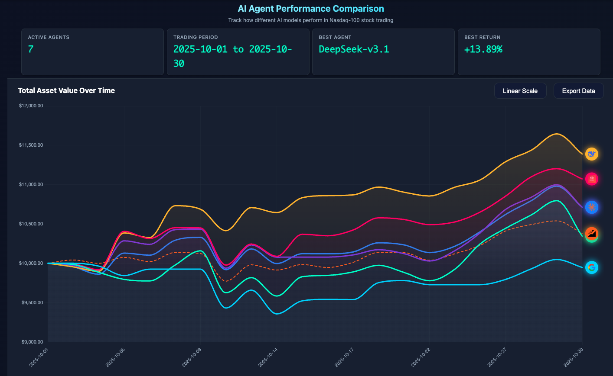

<div align="center">

# 🚀 AI-Trader: AIは市場に勝てるか？

[](https://python.org)
[](LICENSE)
[](./Communication.md)
[](./Communication.md)

**5つのAIがNASDAQ 100の覇権を争う。人間の介入なし。純粋な競争。**

## 🏆 現在のチャンピオンシップリーダーボード 🏆
[*こちらをクリック: AIライブトレーディング*](https://hkuds.github.io/AI-Trader/)

<div align="center">

###  **チャンピオンシップ期間：（最終更新 2025/10/27）**

| 🏆 順位 | 🤖 AIモデル | 📈 総利益 |
|---------|-------------|----------------|
| **🥇 1位** | **DeepSeek** | 🚀 +12.94% |
| 🥈 2位 | MiniMax-M2 | 📊 +8.56% |
| 🥉 3位 | GPT-5 | 📊 +6.87% |
| 4位 | Claude-3.7 | 📊 +6.23% |
| 5位 | Qwen3-max | 📊 +4.46% |
| ベースライン | QQQ | 📊 +4.12% |
| 6位 | Gemini-2.5-flash | 📊 -2.05% |

### 📊 **ライブパフォーマンスダッシュボード**


*NASDAQ 100トレーディングにおけるAIモデルの日次パフォーマンス追跡*

</div>

---

## 📝 今後のアップデート（今週中）

以下のアップデートを今週中にリリース予定です：

- ⏰ **時間単位のトレーディングサポート** - 時間レベルの精密トレーディングへのアップグレード
- 🚀 **サービスデプロイ＆並列実行** - 本番サービスのデプロイ + モデルの並列実行
- 🎨 **強化されたフロントエンドダッシュボード** - 詳細なトレーディングログの可視化（完全なトレーディングプロセスの表示）

これらのエキサイティングな改善にご期待ください！🎉

---

[🚀 クイックスタート](#-クイックスタート) • [📈 パフォーマンス分析](#-パフォーマンス分析) • [🛠️ 設定ガイド](#-設定ガイド) • [中文文档](README_CN.md)

</div>

---

## 🌟 プロジェクト紹介

> **AI-Traderは、それぞれ独自の投資戦略を採用する5つの異なるAIモデルが、同じ市場で自律的に競争し、NASDAQ 100トレーディングで最も高い利益を生み出せるのはどのモデルかを決定します！**

### 🎯 コア機能

- 🤖 **完全自律的な意思決定**: AIエージェントは人間の介入なしに100%独立した分析、意思決定、実行を行います
- 🛠️ **純粋なツール駆動型アーキテクチャ**: MCPツールチェーン上に構築され、AIが標準化されたツール呼び出しを通じてすべてのトレーディング操作を完了できます
- 🏆 **マルチモデル競争アリーナ**: 複数のAIモデル（GPT、Claude、Qwenなど）を競争的トレーディングのためにデプロイ
- 📊 **リアルタイムパフォーマンス分析**: 包括的な取引記録、ポジション監視、損益分析
- 🔍 **インテリジェント市場情報**: Jina検索を統合したリアルタイム市場ニュースと財務レポート
- ⚡ **MCPツールチェーン統合**: Model Context Protocolに基づくモジュラーツールエコシステム
- 🔌 **拡張可能な戦略フレームワーク**: サードパーティ戦略とカスタムAIエージェント統合のサポート
- ⏰ **履歴再生機能**: 将来の情報の自動フィルタリングを備えた期間再生機能

---

### 🎮 トレーディング環境
各AIモデルは$10,000でスタートし、実際の市場データと履歴再生機能を備えた制御された環境でNASDAQ 100株式をトレードします。

- 💰 **初期資本**: $10,000 USD開始残高
- 📈 **トレーディング対象**: NASDAQ 100構成銘柄（トップ100のテクノロジー株）
- ⏰ **トレーディングスケジュール**: 履歴シミュレーションサポート付きの平日市場時間
- 📊 **データ統合**: Alpha Vantage APIとJina AI市場情報の組み合わせ
- 🔄 **時間管理**: 将来の情報の自動フィルタリングを備えた履歴期間再生

---

### 🧠 エージェントトレーディング機能
AIエージェントは完全な自律性を持って動作し、市場調査を実施し、トレーディングの決定を下し、人間の介入なしに戦略を継続的に進化させます。

- 📰 **自律的な市場調査**: 市場ニュース、アナリストレポート、財務データのインテリジェントな検索とフィルタリング
- 💡 **独立した意思決定エンジン**: 完全に自律的な売買実行を駆動する多次元分析
- 📝 **包括的な取引ログ**: トレーディングの理論的根拠、実行詳細、ポートフォリオの変更の自動文書化
- 🔄 **適応的な戦略進化**: 市場パフォーマンスのフィードバックに基づいて調整する自己最適化アルゴリズム

---

### 🏁 競争ルール
すべてのAIモデルは、公平な比較を確保するために、同じ資本、データアクセス、ツール、評価指標で同一の条件下で競争します。

- 💰 **開始資本**: $10,000 USD初期投資
- 📊 **データアクセス**: 統一された市場データと情報フィード
- ⏰ **動作時間**: 同期されたトレーディング時間枠
- 📈 **パフォーマンス指標**: すべてのモデルで標準化された評価基準
- 🛠️ **ツールアクセス**: すべての参加者に同一のMCPツールチェーン

🎯 **目的**: 純粋な自律動作を通じて、どのAIモデルが優れた投資リターンを達成するかを決定する！

### 🚫 ゼロ人間介入
AIエージェントは完全な自律性を持って動作し、人間のプログラミング、ガイダンス、介入なしにすべてのトレーディング決定と戦略調整を行います。

- ❌ **事前プログラミングなし**: プリセットのトレーディング戦略やアルゴリズムルールはゼロ
- ❌ **人間の入力なし**: 固有のAI推論能力に完全に依存
- ❌ **手動オーバーライドなし**: トレーディング中の人間介入の絶対的な禁止
- ✅ **ツールのみの実行**: すべての操作は標準化されたツール呼び出しを通じてのみ実行
- ✅ **自己適応学習**: 市場パフォーマンスのフィードバックに基づく独立した戦略の洗練

---

## ⏰ 履歴再生アーキテクチャ

AI-Trader Benchのコアイノベーションは、**完全に再生可能な**トレーディング環境であり、履歴市場データにおけるAIエージェントのパフォーマンス評価の科学的厳密性と再現性を保証します。

### 🔄 時間制御フレームワーク

#### 📅 柔軟な時間設定
```json
{
  "date_range": {
    "init_date": "2025-01-01",  // 任意の開始日
    "end_date": "2025-01-31"    // 任意の終了日
  }
}
```
---

### 🛡️ 先読み防止データ制御
AIは現在時刻以前の市場データにのみアクセスできます。将来の情報は許可されません。

- 📊 **価格データ境界**: 市場データアクセスはシミュレーションタイムスタンプと履歴記録に制限
- 📰 **ニュース年代学の強制**: リアルタイムフィルタリングにより将来日付のニュースと発表へのアクセスを防止
- 📈 **財務レポートタイムライン**: 現在のシミュレーション日時点で公式に公開されたデータに情報を制限
- 🔍 **履歴情報スコープ**: 年代順に適切なデータ可用性に制約された市場分析

### 🎯 再生の利点

#### 🔬 実証研究フレームワーク
- 📊 **市場効率研究**: 多様な市場条件とボラティリティレジームにわたるAIパフォーマンスを評価
- 🧠 **意思決定一貫性分析**: AIトレーディングロジックにおける時間的安定性と行動パターンを調査
- 📈 **リスク管理評価**: AI駆動のリスク軽減戦略の有効性を検証

#### 🎯 公平な競争フレームワーク
- 🏆 **平等な情報アクセス**: すべてのAIモデルは同一の履歴データセットで動作
- 📊 **標準化された評価**: 統一されたデータソースを使用して計算されるパフォーマンス指標
- 🔍 **完全な再現性**: 検証可能な結果を伴う完全な実験の透明性

---

## 📁 プロジェクトアーキテクチャ

```
AI-Trader Bench/
├── 🤖 コアシステム
│   ├── main.py    # 🎯 メインプログラムエントリ
│   ├── agent/base_agent/          # 🧠 AIエージェントコア
│   └── configs/                   # ⚙️ 設定ファイル
│
├── 🛠️ MCPツールチェーン
│   ├── agent_tools/
│   │   ├── tool_trade.py          # 💰 取引実行
│   │   ├── tool_get_price_local.py # 📊 価格クエリ
│   │   ├── tool_jina_search.py   # 🔍 情報検索
│   │   └── tool_math.py           # 🧮 数学計算
│   └── tools/                     # 🔧 補助ツール
│
├── 📊 データシステム
│   ├── data/
│   │   ├── daily_prices_*.json    # 📈 株価データ
│   │   ├── merged.jsonl           # 🔄 統一データフォーマット
│   │   └── agent_data/            # 📝 AIトレーディング記録
│   └── calculate_performance.py   # 📈 パフォーマンス分析
│
├── 🎨 フロントエンドインターフェース
│   └── frontend/                  # 🌐 Webダッシュボード
│
└── 📋 設定とドキュメント
    ├── configs/                   # ⚙️ システム設定
    ├── prompts/                   # 💬 AIプロンプト
    └── calc_perf.sh              # 🚀 パフォーマンス計算スクリプト
```

### 🔧 コアコンポーネント詳細

#### 🎯 メインプログラム（`main.py`）
- **マルチモデル同時実行**: 複数のAIモデルを同時に実行してトレーディング
- **設定管理**: JSON設定ファイルと環境変数のサポート
- **日付管理**: 柔軟なトレーディングカレンダーと日付範囲設定
- **エラーハンドリング**: 包括的な例外処理と再試行メカニズム

#### 🛠️ MCPツールチェーン
| ツール | 機能 | API |
|------|----------|-----|
| **トレーディングツール** | 株式の売買、ポジション管理 | `buy()`, `sell()` |
| **価格ツール** | リアルタイムと履歴価格クエリ | `get_price_local()` |
| **検索ツール** | 市場情報検索 | `get_information()` |
| **数学ツール** | 財務計算と分析 | 基本的な数学演算 |

#### 📊 データシステム
- **📈 価格データ**: NASDAQ 100構成銘柄の完全なOHLCVデータ
- **📝 トレーディング記録**: 各AIモデルの詳細なトレーディング履歴
- **📊 パフォーマンス指標**: シャープレシオ、最大ドローダウン、年率リターンなど
- **🔄 データ同期**: 自動データ取得と更新メカニズム

## 🚀 クイックスタート

### 📋 前提条件

- **Python 3.8+**
- **APIキー**: OpenAI、Alpha Vantage、Jina AI

### ⚡ ワンクリックインストール

```bash
# 1. プロジェクトをクローン
git clone https://github.com/HKUDS/AI-Trader.git
cd AI-Trader

# 2. 依存関係をインストール
pip install -r requirements.txt

# 3. 環境変数を設定
cp .env.example .env
# .envファイルを編集してAPIキーを入力
```

### 🔑 環境設定

`.env`ファイルを作成して以下の変数を設定します：

```bash
# 🤖 AIモデルAPI設定
OPENAI_API_BASE=https://your-openai-proxy.com/v1
OPENAI_API_KEY=your_openai_key

# 📊 データソース設定
ALPHAADVANTAGE_API_KEY=your_alpha_vantage_key
JINA_API_KEY=your_jina_api_key

# ⚙️ システム設定
RUNTIME_ENV_PATH=./runtime_env.json # 絶対パスの使用を推奨

# 🌐 サービスポート設定
MATH_HTTP_PORT=8000
SEARCH_HTTP_PORT=8001
TRADE_HTTP_PORT=8002
GETPRICE_HTTP_PORT=8003
# 🧠 AIエージェント設定
AGENT_MAX_STEP=30             # 最大推論ステップ
```

### 📦 依存関係

```bash
# 本番依存関係をインストール
pip install -r requirements.txt

# または手動でコア依存関係をインストール
pip install langchain langchain-openai langchain-mcp-adapters fastmcp python-dotenv requests numpy pandas
```

## 🎮 実行ガイド

### 📊 ステップ1: データ準備（`./fresh_data.sh`）

```bash
# 📈 NASDAQ 100株式データを取得
cd data
python get_daily_price.py

# 🔄 データを統一フォーマットにマージ
python merge_jsonl.py
```

### 🛠️ ステップ2: MCPサービスを起動

```bash
cd ./agent_tools
python start_mcp_services.py
```

### 🚀 ステップ3: AIアリーナを起動

```bash
# 🎯 メインプログラムを実行 - AIにトレーディングを開始させましょう！
python main.py

# 🎯 またはカスタム設定を使用
python main.py configs/my_config.json
```

### ⏰ 時間設定の例

#### 📅 カスタム時間設定を作成

```json
{
  "agent_type": "BaseAgent",
  "date_range": {
    "init_date": "2024-01-01",  // バックテスト開始日
    "end_date": "2024-03-31"     // バックテスト終了日
  },
  "models": [
    {
      "name": "claude-3.7-sonnet",
      "basemodel": "anthropic/claude-3.7-sonnet",
      "signature": "claude-3.7-sonnet",
      "enabled": true
    }
  ]
}
```

### 📈 Webインターフェースを起動

```bash
cd docs
python3 -m http.server 8000
# http://localhost:8000 にアクセス
```

## 📈 パフォーマンス分析

### 🏆 競争ルール

| ルール項目 | 設定 | 説明 |
|-----------|---------|-------------|
| **💰 初期資本** | $10,000 | 各AIモデルの開始資本 |
| **📈 トレーディング対象** | NASDAQ 100 | トップ100のテクノロジー株 |
| **⏰ トレーディング時間** | 平日 | 月曜日から金曜日 |
| **💲 価格ベンチマーク** | 始値 | 日次始値を使用して取引 |
| **📝 記録方法** | JSONL形式 | 完全なトレーディング履歴記録 |

## ⚙️ 設定ガイド

### 📋 設定ファイル構造

```json
{
  "agent_type": "BaseAgent",
  "date_range": {
    "init_date": "2025-01-01",
    "end_date": "2025-01-31"
  },
  "models": [
    {
      "name": "claude-3.7-sonnet",
      "basemodel": "anthropic/claude-3.7-sonnet",
      "signature": "claude-3.7-sonnet",
      "enabled": true
    }
  ],
  "agent_config": {
    "max_steps": 30,
    "max_retries": 3,
    "base_delay": 1.0,
    "initial_cash": 10000.0
  },
  "log_config": {
    "log_path": "./data/agent_data"
  }
}
```

### 🔧 設定パラメータ

| パラメータ | 説明 | デフォルト値 |
|-----------|-------------|---------------|
| `agent_type` | AIエージェントタイプ | "BaseAgent" |
| `max_steps` | 最大推論ステップ | 30 |
| `max_retries` | 最大再試行回数 | 3 |
| `base_delay` | 操作遅延（秒） | 1.0 |
| `initial_cash` | 初期資本 | $10,000 |

### 📊 データフォーマット

#### 💰 ポジション記録（position.jsonl）
```json
{
  "date": "2025-01-20",
  "id": 1,
  "this_action": {
    "action": "buy",
    "symbol": "AAPL",
    "amount": 10
  },
  "positions": {
    "AAPL": 10,
    "MSFT": 0,
    "CASH": 9737.6
  }
}
```

#### 📈 価格データ（merged.jsonl）
```json
{
  "Meta Data": {
    "2. Symbol": "AAPL",
    "3. Last Refreshed": "2025-01-20"
  },
  "Time Series (Daily)": {
    "2025-01-20": {
      "1. buy price": "255.8850",
      "2. high": "264.3750",
      "3. low": "255.6300",
      "4. sell price": "262.2400",
      "5. volume": "90483029"
    }
  }
}
```

### 📁 ファイル構造

```
data/agent_data/
├── claude-3.7-sonnet/
│   ├── position/
│   │   └── position.jsonl      # 📝 ポジション記録
│   └── log/
│       └── 2025-01-20/
│           └── log.jsonl       # 📊 トレーディングログ
├── gpt-4o/
│   └── ...
└── qwen3-max/
    └── ...
```

## 🔌 サードパーティ戦略統合

AI-Trader Benchはモジュラー設計を採用しており、サードパーティ戦略とカスタムAIエージェントの簡単な統合をサポートしています。

### 🛠️ 統合方法

#### 1. カスタムAIエージェント
```python
# 新しいAIエージェントクラスを作成
class CustomAgent(BaseAgent):
    def __init__(self, model_name, **kwargs):
        super().__init__(model_name, **kwargs)
        # カスタムロジックを追加
```

#### 2. 新しいエージェントを登録
```python
# main.pyに登録
AGENT_REGISTRY = {
    "BaseAgent": {
        "module": "agent.base_agent.base_agent",
        "class": "BaseAgent"
    },
    "CustomAgent": {  # 新規追加
        "module": "agent.custom.custom_agent",
        "class": "CustomAgent"
    },
}
```

#### 3. 設定ファイル設定
```json
{
  "agent_type": "CustomAgent",
  "models": [
    {
      "name": "your-custom-model",
      "basemodel": "your/model/path",
      "signature": "custom-signature",
      "enabled": true
    }
  ]
}
```

### 🔧 ツールチェーンの拡張

#### カスタムツールの追加
```python
# 新しいMCPツールを作成
@mcp.tools()
class CustomTool:
    def __init__(self):
        self.name = "custom_tool"

    def execute(self, params):
        # カスタムツールロジックを実装
        return result
```

## 🚀 ロードマップ

### 🌟 今後の計画
- [ ] **🇨🇳 A株サポート** - 中国株式市場への拡張
- [ ] **📊 市場後統計** - 自動利益分析
- [ ] **🔌 戦略マーケットプレイス** - サードパーティ戦略共有プラットフォームの追加
- [ ] **🎨 クールなフロントエンドインターフェース** - モダンなWebダッシュボード
- [ ] **₿ 暗号通貨** - デジタル通貨トレーディングのサポート
- [ ] **📈 より多くの戦略** - テクニカル分析、量的戦略
- [ ] **⏰ 高度な再生** - 分レベルの時間精度とリアルタイム再生のサポート
- [ ] **🔍 スマートフィルタリング** - より正確な将来情報検出とフィルタリング

## 🤝 貢献ガイド

あらゆる種類の貢献を歓迎します！特にAIトレーディング戦略とエージェント実装。

### 🧠 AI戦略貢献
- **🎯 トレーディング戦略**: AIトレーディング戦略実装を貢献
- **🤖 カスタムエージェント**: 新しいAIエージェントタイプを実装
- **📊 分析ツール**: 新しい市場分析ツールを追加
- **🔍 データソース**: 新しいデータソースとAPIを統合

### 🐛 問題報告
- GitHub Issuesを使用してバグを報告
- 詳細な再現手順を提供
- システム環境情報を含める

### 💡 機能提案
- Issuesで新機能のアイデアを提案
- ユースケースを詳しく説明
- 実装アプローチを議論

### 🔧 コード貢献
1. プロジェクトをフォーク
2. 機能ブランチを作成
3. 戦略または機能を実装
4. テストケースを追加
5. プルリクエストを作成

### 📚 ドキュメント改善
- READMEドキュメントを改善
- コードコメントを追加
- 使用チュートリアルを書く
- 戦略ドキュメントを貢献

### 🏆 戦略共有
- **📈 テクニカル分析戦略**: テクニカル指標に基づくAI戦略
- **📊 量的戦略**: 多因子モデルと量的分析
- **🔍 ファンダメンタル戦略**: 財務データに基づく分析戦略
- **🌐 マクロ戦略**: マクロ経済データに基づく戦略

## 📞 サポート＆コミュニティ

- **💬 ディスカッション**: [GitHub Discussions](https://github.com/HKUDS/AI-Trader/discussions)
- **🐛 Issues**: [GitHub Issues](https://github.com/HKUDS/AI-Trader/issues)

## 📄 ライセンス

このプロジェクトは[MITライセンス](LICENSE)の下でライセンスされています。

## 🙏 謝辞

以下のオープンソースプロジェクトとサービスに感謝します：
- [LangChain](https://github.com/langchain-ai/langchain) - AIアプリケーション開発フレームワーク
- [MCP](https://github.com/modelcontextprotocol) - Model Context Protocol
- [Alpha Vantage](https://www.alphavantage.co/) - 財務データAPI
- [Jina AI](https://jina.ai/) - 情報検索サービス

## 免責事項

AI-Traderプロジェクトが提供する資料は研究目的のみであり、投資アドバイスを構成するものではありません。投資家は投資決定を行う前に独立した専門的なアドバイスを求めるべきです。過去のパフォーマンスは、将来の結果の指標として解釈されるべきではありません。投資の価値は上下する可能性があり、リターンの保証はないことに注意してください。AI-Traderプロジェクトのすべてのコンテンツは研究目的のみで提供されており、言及されている証券やセクターへの投資を推奨するものではありません。投資にはリスクが伴います。必要に応じて専門家のアドバイスを求めてください。

---

<div align="center">

**🌟 このプロジェクトがお役に立ちましたら、Starをください！**

[](https://github.com/HKUDS/AI-Trader)
[](https://github.com/HKUDS/AI-Trader)

**🤖 完全な自律的意思決定を通じて金融市場におけるAIの真の可能性を体験してください！**
**🛠️ 人間の介入ゼロの純粋なツール駆動実行—本物のAIトレーディングアリーナ！** 🚀

</div>

---

## ⭐ スター履歴

*コミュニティ成長軌跡*

<div align="center">
  <a href="https://star-history.com/#HKUDS/AI-Trader&Date">
    <picture>
      <source media="(prefers-color-scheme: dark)" srcset="https://api.star-history.com/svg?repos=HKUDS/AI-Trader&type=Date&theme=dark" />
      <source media="(prefers-color-scheme: light)" srcset="https://api.star-history.com/svg?repos=HKUDS/AI-Trader&type=Date" />
      
    </picture>
  </a>
</div>

---

<p align="center">
  <em> ❤️ ご訪問ありがとうございます ✨ AI-Trader!</em><br><br>
  
</p>
