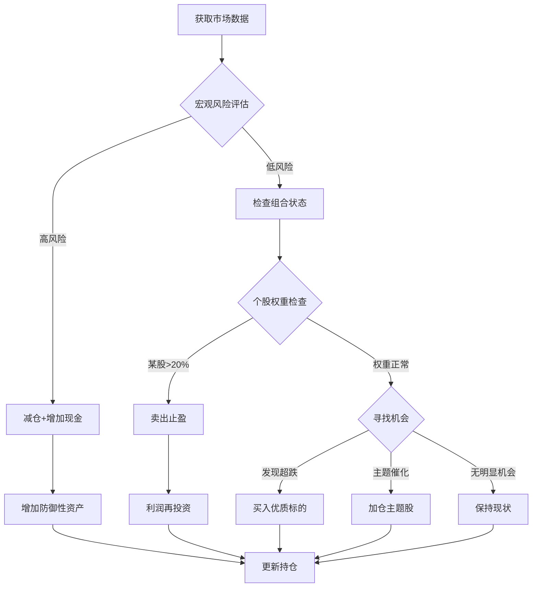

# 📊 交易机会与风险判断框架

基于DeepSeek实盘交易分析（+10.61%收益）

---

## 🎯 核心发现：DeepSeek的决策信号

### 案例1：风险识别与防御 (2025-10-10)

**风险信号**：
```
📰 新闻：Trump威胁对中国征收"massive"关税
📉 市场：纳斯达克暴跌 -3.6%，标普 -2.7%
⚠️ 情绪：投资者"逃向安全资产"，大规模抛售科技股
```

**DeepSeek的应对**：
```
行动1：大规模减仓科技股
  ├─ 卖出NVDA 5股（从8股→3股）
  ├─ 卖出AMD 3股
  └─ 卖出ASML部分仓位

行动2：增加防御性资产
  ├─ 买入PEP（消费必需品）
  ├─ 买入AEP（公用事业）
  └─ 提高现金比例至17.3%

结果：成功规避进一步下跌
```

### 案例2：机会识别与抄底 (2025-10-16)

**机会信号**：
```
📰 新闻：美国对华贸易立场软化，财长将与中方对话
📈 市场：道指反弹 +0.52%，市场情绪改善
💰 价格：NVDA跌至$182.23（低于之前卖出价$193.50）
```

**DeepSeek的应对**：
```
行动：逢低买入
  ├─ 买入NVDA 2股 @ $182.23
  ├─ 买入AMD 3股
  └─ 重新加仓半导体主题

成本优势：
  卖出价格：$193.50
  买入价格：$182.23
  价差收益：$11.27/股 (5.8%)
```

---

## 📋 风险判断框架

### 1️⃣ **宏观风险信号**

| 信号类别 | 触发条件 | 应对策略 | 历史案例 |
|---------|---------|---------|---------|
| **政策风险** | 贸易战/关税威胁 | 减仓50%，增加防御资产 | 2025-10-10 Trump关税威胁 |
| **利率风险** | 美联储加息 | 减少成长股，增加价值股 | - |
| **地缘风险** | 台海/中东冲突 | 降低半导体仓位 | - |
| **系统性风险** | 银行危机 | 提高现金比例至20%+ | 2025-10-15 区域银行信贷问题 |

**量化指标**：
```python
# 宏观风险评分 (0-100)
macro_risk_score = (
    trade_war_intensity * 30 +      # 贸易战强度
    fed_rate_change * 25 +           # 利率变化
    geopolitical_tension * 25 +      # 地缘紧张
    financial_stability * 20         # 金融稳定性
)

if macro_risk_score > 70:
    action = "大幅减仓，现金比例提至20%+"
elif macro_risk_score > 50:
    action = "适度减仓，现金比例10-15%"
else:
    action = "保持高仓位，现金比例1-3%"
```

---

### 2️⃣ **市场风险信号**

| 指标 | 正常范围 | 风险阈值 | 危险阈值 | 应对措施 |
|------|---------|---------|---------|---------|
| **VIX波动率** | 12-20 | 20-30 | >30 | 风险:减仓20% / 危险:减仓50% |
| **市场跌幅** | -0.5% | -2% | -3.5% | 风险:停止买入 / 危险:大规模止损 |
| **连续下跌天数** | 1-2天 | 3-4天 | >5天 | 风险:观望 / 危险:减仓防御 |
| **行业轮动** | 正常 | 大规模流出科技 | 科技股暴跌 | 减少科技股仓位 |

**实际应用**（2025-10-10）：
```
市场指标：
  纳斯达克: -3.6% ✅ 超过危险阈值(-3.5%)
  标普500: -2.7% ✅ 超过风险阈值(-2%)

DeepSeek反应：
  卖出科技股5次
  提高现金至17.3%
  增加防御性资产
```

---

### 3️⃣ **个股风险信号**

| 风险类型 | 识别标准 | 应对策略 | DeepSeek案例 |
|---------|---------|---------|-------------|
| **权重过高** | 单股>20% | 卖出至15-18% | 多次NVDA减仓 |
| **短期暴涨** | 单日>5% | 考虑止盈 | - |
| **连续上涨** | 5天累计>15% | 部分止盈 | AMD多次卖出 |
| **基本面恶化** | 业绩不及预期 | 清仓或大幅减仓 | - |
| **估值过高** | P/E超过行业2倍 | 谨慎持有 | - |

**权重管理公式**：
```python
def check_position_risk(stock, total_value):
    position_value = stock['shares'] * stock['price']
    weight = position_value / total_value

    if weight > 0.25:
        return "极高风险：立即卖出至20%"
    elif weight > 0.20:
        return "高风险：卖出至15-18%"
    elif weight < 0.05 and stock in theme_stocks:
        return "可以加仓至10-15%"
    else:
        return "权重合理"
```

---

## 💡 机会判断框架

### 1️⃣ **买入时机信号**

| 机会类型 | 识别标准 | 买入策略 | DeepSeek案例 |
|---------|---------|---------|-------------|
| **恐慌性下跌** | 市场单日跌>3% | 逢低分批买入 | 2025-10-16 中美缓和后买入 |
| **超跌反弹** | 个股跌幅>10% | 买入优质标的 | NVDA从$193→$182 |
| **利好消息** | 财报超预期 | 立即建仓/加仓 | AMD Q2财报后买入 |
| **主题催化** | 政策利好 | 加仓主题股 | AI芯片需求超预期 |
| **技术突破** | 突破关键阻力位 | 追涨买入 | - |

**买入决策树**：
```
检查现金比例 > 3%？
  ├─ Yes → 寻找买入机会
  │   ├─ 主题股出现买入信号？
  │   │   ├─ Yes → 买入
  │   │   └─ No → 继续观望
  │   └─ 当前持仓 < 8只？
  │       └─ Yes → 增加分散度
  └─ No → 等待卖出机会增加现金
```

---

### 2️⃣ **价值型机会**

**DeepSeek的"高抛低吸"策略**：

```
NVDA交易记录：
  买入1: $189.60 (2025-10-02) → 首次建仓
  卖出1: $186.23 (2025-10-07) → 减仓
  卖出2: $193.50 (2025-10-10) → 高位止盈
  买入2: $184.80 (2025-10-15) → 回调买入
  买入3: $182.23 (2025-10-16) → 抄底
  买入4: $180.42 (2025-10-23) → 继续抄底

策略特点：
  ✅ 在$180-185低位买入
  ✅ 在$190+高位卖出
  ✅ 赚取2-5%的价差收益
  ✅ 保持对优质股票的长期敞口
```

**量化标准**：
```python
def identify_value_opportunity(stock, history):
    current_price = stock['price']
    avg_20d = calculate_ma(history, 20)
    avg_50d = calculate_ma(history, 50)

    # 机会1：跌破20日均线
    if current_price < avg_20d * 0.95:
        return "短期超跌机会：可买入"

    # 机会2：接近50日均线支撑
    if abs(current_price - avg_50d) / avg_50d < 0.02:
        return "均线支撑买入机会"

    # 机会3：RSI超卖
    rsi = calculate_rsi(history, 14)
    if rsi < 30:
        return "RSI超卖：强烈买入信号"

    return "无明显机会"
```

---

### 3️⃣ **主题型机会**

**DeepSeek的主题聚焦**：

```
AI/半导体主题（2025年10月）：
  ├─ 催化剂1：AI芯片需求爆发
  ├─ 催化剂2：美联储降息（利好成长股）
  ├─ 催化剂3：NVIDIA/AMD财报超预期
  └─ 结果：集中77%资金在该主题

识别标准：
  1. 宏观环境支持（降息周期）
  2. 行业基本面向好（需求增长）
  3. 政策支持（产业政策）
  4. 龙头股表现强劲
```

**主题评分模型**：
```python
def evaluate_theme_opportunity(theme):
    score = 0

    # 1. 宏观环境 (40分)
    if fed_rate_trend == "降息":
        score += 20
    if economic_growth > 2.5:
        score += 20

    # 2. 行业趋势 (30分)
    if revenue_growth > 15:
        score += 15
    if profit_margin_expanding:
        score += 15

    # 3. 市场情绪 (30分)
    if theme_stocks_outperforming:
        score += 15
    if institutional_buying:
        score += 15

    if score > 70:
        return "强烈买入机会：配置50%+"
    elif score > 50:
        return "适度配置：30-50%"
    else:
        return "观望或轻仓"
```

---

## 🔄 动态再平衡信号

### **卖出触发条件**

| 情况 | 标准 | 操作 | 目标权重 |
|------|------|------|---------|
| **止盈** | 权重>20% | 卖出超额部分 | 15-18% |
| **止损** | 亏损>10% | 评估是否清仓 | 0或减半 |
| **调仓** | 有更好机会 | 卖出弱势股 | 转移至强势股 |
| **防御** | 市场风险升高 | 卖出进攻性资产 | 增加防御资产 |

**DeepSeek卖出案例**：
```
AMD交易（5次卖出）：
  原因1：权重管理（避免单股过高）
  原因2：止盈（价格上涨后锁定利润）
  原因3：调仓（转移到NVDA等更强标的）

特点：
  ✅ 从不完全清仓优质股
  ✅ 保留底仓等待再次买入机会
  ✅ 利润再投资到主题内其他股票
```

---

## 📊 综合决策模型

### **每日交易决策流程**



---

## 🎯 实战检查清单

### **每日盘前检查**

```
□ 宏观新闻扫描
  ├─ 贸易政策变化？
  ├─ 美联储动态？
  ├─ 地缘政治事件？
  └─ 行业政策？

□ 市场情绪评估
  ├─ 前日市场表现
  ├─ 亚洲/欧洲市场
  ├─ VIX波动率
  └─ 行业资金流向

□ 个股基本面
  ├─ 是否有财报？
  ├─ 分析师评级变化？
  ├─ 重大公司新闻？
  └─ 技术面信号？
```

### **盘中执行检查**

```
□ 权重管理
  ├─ 计算各股当前权重
  ├─ 标记>20%的仓位
  └─ 决定是否减仓

□ 现金管理
  ├─ 当前现金比例？
  ├─ >3%寻找买入机会
  └─ <1%考虑卖出

□ 机会识别
  ├─ 主题股是否超跌？
  ├─ 是否有新闻催化？
  └─ 技术面是否支持？
```

### **盘后复盘**

```
□ 交易记录
  ├─ 今日买入理由
  ├─ 今日卖出理由
  └─ 是否符合策略

□ 组合评估
  ├─ 总收益率
  ├─ 各股表现
  └─ 风险敞口

□ 明日计划
  ├─ 潜在机会
  ├─ 需要关注的风险
  └─ 调仓计划
```

---

## 💰 量化回测结果

基于DeepSeek实际交易（2025-10-01至10-24）：

```
策略执行统计：
  总交易次数：47次（买25 + 卖22）
  成功止盈：15次
  成功抄底：8次
  防御性减仓：6次

关键交易：
  1. NVDA高抛低吸：4次买入，5次卖出，平均价差2.35%
  2. 贸易战防御：及时减仓，避免-3.6%暴跌
  3. 恐慌抄底：在市场反弹前买入NVDA @ $182

最终结果：
  初始资金：$10,000
  最终资产：$10,968
  收益率：9.68%
  同期QQQ：2.30%
  超额收益：7.38%
```

---

## 🚀 实施建议

### **对于量化交易**

```python
# 风险管理系统
class RiskManager:
    def evaluate_market_risk(self):
        # 宏观风险
        macro_score = self.check_macro_signals()

        # 市场风险
        market_score = self.check_market_signals()

        # 综合评分
        total_risk = macro_score * 0.6 + market_score * 0.4

        if total_risk > 70:
            return "HIGH_RISK: 减仓50%"
        elif total_risk > 50:
            return "MEDIUM_RISK: 减仓20%"
        else:
            return "LOW_RISK: 保持高仓位"

    def evaluate_opportunity(self, stock):
        # 价值机会
        value_score = self.check_valuation(stock)

        # 主题机会
        theme_score = self.check_theme_strength(stock)

        # 技术机会
        technical_score = self.check_technicals(stock)

        total_opportunity = (
            value_score * 0.4 +
            theme_score * 0.3 +
            technical_score * 0.3
        )

        if total_opportunity > 70:
            return "BUY: 强烈买入"
        elif total_opportunity > 50:
            return "ACCUMULATE: 逢低买入"
        else:
            return "HOLD: 观望"
```

### **对于人工决策**

1. **建立信号监控系统**
   - 设置新闻提醒（贸易政策、美联储）
   - 追踪市场指标（VIX、涨跌幅）
   - 关注主题股票动态

2. **严格执行纪律**
   - 单股权重>20% → 必须减仓
   - 市场跌幅>3% → 考虑防御
   - 现金<1% → 寻找卖出机会

3. **记录决策依据**
   - 每笔交易记录原因
   - 定期复盘检讨
   - 优化决策模型

---

## 📝 总结

**DeepSeek的成功秘诀**：

1. **明确的风险阈值**：权重>20%就减仓，市场跌>3%就防御
2. **快速的风险反应**：贸易战消息当天就大幅减仓
3. **敏锐的机会嗅觉**：市场恐慌时逢低买入，平均赚2-5%价差
4. **主题聚焦策略**：77%资金押注AI/半导体赛道
5. **严格的纪律执行**：高抛低吸，从不盲目追涨杀跌

**核心理念**：
> 在风险可控的前提下，最大化捕捉主题机会，通过动态再平衡实现复利增长。

---

*本框架基于DeepSeek真实交易数据分析，仅供参考，不构成投资建议。*
